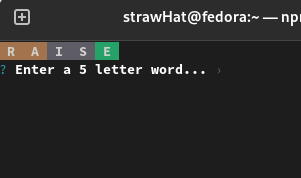
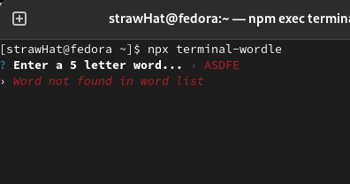
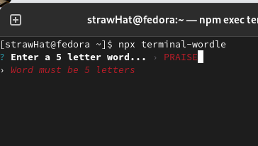
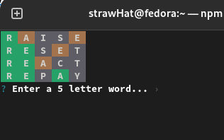
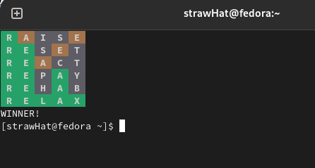

# Wordle Terminal

A clone of the famous wordle game built for the terminal.

Original Wordle - [Wordle](https://www.powerlanguage.co.uk/wordle/)

Terminal version can be played using the following command -

`npx terminal-wordle `

## Screenshots of the CLI app -

 

